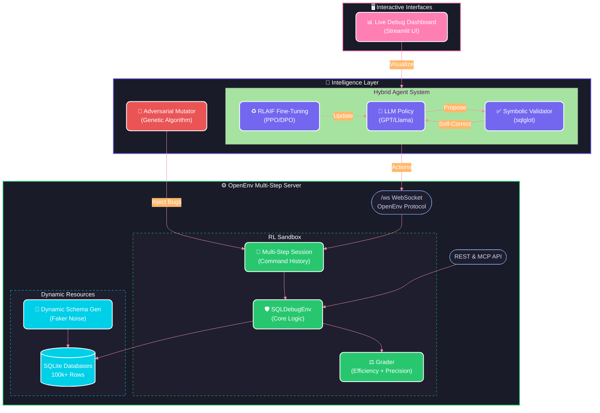

# 🛠️ SQL Debug Environment

An OpenEnv-compatible reinforcement learning environment for training AI agents to debug SQL queries — built for the **OpenEnv Hackathon by Meta × Hugging Face × Scaler School of Technology**.

    

📘 **[Read the Complete Project Documentation & Hackathon Strategy Strategy](sql_debug_env_documentation.md)**

---

## 🏗️ Architecture



---

## 🧠 What This Environment Does

An agent receives a broken SQL query and a database schema. It must fix the query interactively over **multiple steps** via a conversational debug session (`EXPLAIN`, `DESCRIBE`, `SUBMIT_QUERY`), earning rewards based on:

- ✅ **Correctness** — does the output match the expected result?
- ⚡ **Efficiency** — fewer meta-actions = higher reward
- 🎯 **Exploration** — partial credit for utilizing `EXPLAIN` or introspecting the schema
- 🤖 **Self-Correction** — symbolic validation catches hallucinatory queries before they drop reward

The environment supports **4 difficulty levels** + **dynamic schemas** continuously evolved by our genetic Adversarial Generator.

---

## 🚀 Quick Start

### 1. Run the Backend OpenEnv Server Locally

```bash
git clone https://github.com/Aryan-coder-2025/sql-debug-env
cd sql-debug-env
pip install -r requirements.txt
python main.py
```

The server starts at `http://localhost:7860`. No API keys required.

### 2. View the Live Streamlit Dashboard

The dashboard requires an LLM API key for the agent (Groq is free). Copy `.env.example` to `.env` and add your key:

```bash
cp .env.example .env
# Edit .env and add your GROQ_API_KEY (free at console.groq.com)
```

Then in a new terminal:
```bash
pip install streamlit pandas plotly sqlglot openai faker
export GROQ_API_KEY="your_key_here"       # Linux/Mac
$env:GROQ_API_KEY="your_key_here"         # Windows PowerShell
streamlit run dashboard.py
```

#### 🖥️ Understanding the Dashboard UI
The dashboard is highly optimized with Streamlit caching and session states. It **auto-starts** when you open it — generating a random buggy query and running the AI agent to fix it automatically. Here's what you'll see:

1. **Agent Internal Reasoning**: Shows the raw thoughts of the LLM before it executes a command.
2. **Query Evolution**: Side-by-side diff of the original buggy query vs. the agent's proposed fix.
3. **Session History Log**: Step-by-step history of commands the agent executed (e.g. `EXPLAIN SELECT...` or `DESCRIBE users`) and the exact feedback the environment returned.
4. **Reward Accumulation**: Tracks the agent's RL score as a line chart. Rewards are fractional (0.05–0.95), composed of correctness (0.60), exploration bonus (up to 0.20), and efficiency bonus (up to 0.15).
5. **Control Panel**:
    - **Start Debugging**: Generates a new random session and auto-runs the agent.
    - **Step Agent**: Forces the agent to take exactly *one* debugging action for manual inspection.
    - **Run to Fix**: The agent takes steps automatically until it finds the correct answer.

### 3. Run the Genetic Adversarial Generator

Watch a self-improving loop of mutated SQL bugs compete against the LLM Agent:
```bash
python adversarial_generator.py
```

---

## 📡 API Reference

| Method | Endpoint | Description |
|--------|----------|-------------|
| `WS` | `/ws` | WebSocket (OpenEnv protocol) |
| `GET` | `/health` | Liveness check |
| `GET` | `/` | Environment info & available endpoints |
| `GET` | `/tasks` | List all tasks with schemas |
| `GET` | `/validate` | Self-validation against OpenEnv spec |
| `POST` | `/reset` | Start a new episode (`task_id`, `session_id`) |
| `POST` | `/step` | Submit SQL action (`type`, `sql`, `reasoning`) |
| `GET` | `/state` | Current episode state |
| `GET` | `/grader` | Episode grading score |
| `GET` | `/baseline` | Run baseline agent on all tasks |
| `GET` | `/metrics` | Live telemetry (sessions, success rate) |
| `GET` | `/trajectories` | List trajectory replay files |
| `POST` | `/mcp` | Model Context Protocol (JSON-RPC 2.0) |
| `GET` | `/docs` | Interactive Swagger API documentation |

---

## 🎯 Task Generation

We use three distinct methods to challenge the agents:
1. **Static Task Registry**: 34 handmade scenarios across 4 difficulty levels spanning syntax, JOIN logic, subqueries, and strict Security (SQL injections).
2. **Dynamic Generation (`dynamic_schema.py`)**: Uses `Faker` to inject noisy schemas (NULLs, dirty strings in INT fields, duplicates).
3. **Adversarial Mutation (`adversarial_generator.py`)**: A Genetic Algorithm rips apart correct queries (dropping conditionals, breaking `ON` statements) explicitly optimizing to defeat the LLM agent.

---

## 🚀 Advanced Hackathon Features
- **SQL Code Golf (AST Complexity Scoring)**: We parse agent submitts via `sqlglot` to calculate Abstract Syntax Tree (AST) node depth. Agents that solve queries elegantly (concisely) receive up to a +0.05 reward bonus, actively punishing bloat and spaghetti SQL.
- **Symbolic Pre-Validation**: The environment parses queries internally *before* querying SQLite. Malformed schemas get instant fractional penalties without waiting for sluggish DB operational errors.
- **Real-time DevOps Telemetry API**: Using `/telemetry/live` and `/telemetry/ast` endpoints, judges can monitor avg execution times globally alongside median query complexity profiles!

---

## 📊 Reward Structure

### Core Environment Rewards (`environment.py`)

| Action / Signal | Value | Description |
|--------|-------|-------------|
| Valid query result | +0.05 | Any non-error execution |
| ≥ 50% correctness | +0.20 | Partial row match |
| ≥ 90% correctness | +0.40 | Near-exact match |
| 100% correctness | +0.20 | Exact output match |
| SQL Execution Error | −0.05 | Query failed or was hallucinated |
| Late steps (> step 5) | −0.05/step | Efficiency penalty |
| Full Table Scan | −0.10 | Penalized via EXPLAIN QUERY PLAN |
| Index Search | +0.10 | Rewarded via EXPLAIN QUERY PLAN |

### Multi-Step Session Rewards (`multi_step_env.py`)

| Action / Signal | Value | Description |
|--------|-------|-------------|
| `SHOW_TABLES` | +0.10 | Reward for inspecting available tables |
| `DESCRIBE <table>` | +0.20 | Reward for inspecting table schema |
| `EXPLAIN <sql>` | +0.10 | Reward for investigating query plans |
| Correct `SUBMIT_QUERY` | 0.60 + bonuses | Base (0.60) + exploration (up to 0.20) + efficiency (up to 0.15) |
| Incorrect `SUBMIT_QUERY` | Partial credit | `correctness × 0.4` |
| `GIVE_UP` | −1.00 | Agent aborted the session |
| Timeout (max steps) | −1.00 | Failed to fix within step limit |

> **Rewards are always fractional** (clamped to 0.05–0.95), never exactly 0.0 or 1.0.

---

## 🔌 OpenEnv Framework Integration

This environment fully integrates with the [OpenEnv](https://github.com/meta-pytorch/OpenEnv) framework:

- ✅ `Environment` base class from `openenv-core`
- ✅ `HTTPEnvServer` for WebSocket + MCP transport
- ✅ Typed `Action`, `Observation`, `State` Pydantic models
- ✅ Concurrent session support (50 max)
- ✅ Session isolation via `session_id`
- ✅ Trajectory replay logging

---

## 📁 Project Structure

```text
sql-debug-env/
├── main.py                    # FastAPI Server + REST + WS + MCP Endpoints
├── environment.py             # SQLDebugEnv (OpenEnv Environment subclass)
├── models.py                  # Typed Pydantic models (Action, Observation, State)
├── grader.py                  # Episode grading (Correctness + Efficiency)
├── openenv.yaml               # OpenEnv manifest
├── client.py                  # EnvClient SDK
├── dashboard.py               # 📊 Live Streamlit Debugging UI (auto-run)
├── hybrid_agent.py            # 🤖 LLM Policy + Symbolic Validator (sqlglot)
├── adversarial_generator.py   # 👾 Genetic Mutator to craft difficult SQL bugs
├── multi_step_env.py          # 🔄 Gym wrapper with session history & fractional rewards
├── dynamic_schema.py          # 🎲 Noisy Data / Schema Generator (Faker)
├── inference.py               # Inference utilities
├── .env.example               # Required environment variables template
├── Dockerfile                 # Container build for HF Spaces deployment
├── requirements.txt           # Python dependencies
├── tasks/
│   ├── task_easy.py           # 11 easy scenarios (syntax errors)
│   ├── task_medium.py         # 9 medium scenarios (JOIN logic)
│   ├── task_hard.py           # 9 hard scenarios (subqueries, optimization)
│   └── task_security.py       # 5 security scenarios (SQL injection, data leaks)
├── tests/
│   └── test_environment.py    # 38 automated tests (pytest)
├── baseline/
│   └── run_baseline.py        # Baseline agent benchmark runner
├── server/
│   ├── app.py                 # Server entry point
│   └── api.py                 # API router
└── outputs/
    └── trajectories/          # Auto-saved episode replay logs (JSON)
```

---

## 🧪 Testing

Run the full test suite (38 tests):

```bash
pip install pytest
pytest tests/test_environment.py -v
```

| Category | Tests | Coverage |
|----------|-------|----------|
| Environment Reset | 8 | All difficulties, state clearing, invalid task handling |
| Step Execution | 7 | Correctness scoring, reward signals, max steps timeout |
| Safety Filter | 10 | Blocks DROP/DELETE/TRUNCATE/UPDATE/INSERT/ALTER/CREATE/ATTACH |
| Correctness Scoring | 4 | Exact match, partial match, no result, empty result |
| Grader | 4 | Score clamping, perfect/failed episodes |
| Dynamic Schema | 4 | DB generation, varied difficulty distribution |
| Session Isolation | 1 | Concurrent environments don't interfere |

---

## 👥 Team

- **Aarush** — Core environment & API
- **Chetanya** — Task design & grading
- **Aryan** — Deployment & baseline agent

Built for the **OpenEnv Hackathon** by Meta × Hugging Face × Scaler School of Technology.

---

## 📜 License

MIT License
