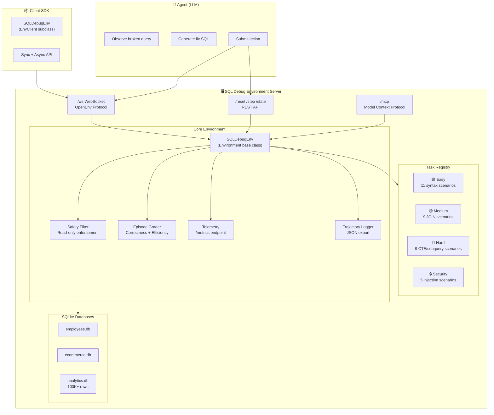

# 🛠️ SQL Debug Environment

An OpenEnv-compatible reinforcement learning environment for training AI agents to debug SQL queries — built for the **OpenEnv Hackathon by Meta × Hugging Face × Scaler School of Technology**.

   

---

## 🏗️ Architecture



---

## 🧠 What This Environment Does

An agent receives a broken SQL query and a database schema. It must fix the query step-by-step, earning rewards based on:

- ✅ **Correctness** — does the output match the expected result?
- ⚡ **Efficiency** — fewer steps = higher reward
- 🎯 **Precision** — partial credit for partially correct results
- 🔒 **Security** — identify and fix SQL injection vulnerabilities

The environment supports **4 difficulty levels** across real SQLite databases with 100k+ rows.

---

## 🚀 Quick Start

### Run Locally

```bash
git clone https://github.com/Aryan-coder-2025/sql-debug-env
cd sql-debug-env
pip install -r requirements.txt
python main.py
```

### Run with Docker

```bash
docker build -t sql-debug-env .
docker run -p 7860:7860 sql-debug-env
```

### Use as a Client (Python SDK)

```python
from client import SQLDebugEnv, SQLDebugAction

# Async usage (recommended)
async with SQLDebugEnv(base_url="https://aryan-coder-25-openenv.hf.space") as env:
    result = await env.reset(task_id="easy")
    print(result.observation.broken_query)
    
    action = SQLDebugAction(type="run_sql", sql="SELECT name FROM employees")
    result = await env.step(action)
    print(f"Correctness: {result.observation.metadata['correctness']}")

# Sync usage
with SQLDebugEnv(base_url="http://localhost:7860").sync() as env:
    result = env.reset(task_id="medium")
    result = env.step(SQLDebugAction(type="fix_query", sql="..."))
```

---

## 📡 API Reference

| Method | Endpoint | Description |
|--------|----------|-------------|
| `GET` | `/` | Environment info and endpoint list |
| `GET` | `/health` | Health check (`{"status": "healthy"}`) |
| `POST` | `/reset` | Start a new episode (`task_id`, `session_id`) |
| `POST` | `/step` | Submit SQL action (`type`, `sql`, `reasoning`) |
| `GET` | `/state` | Current episode state |
| `GET` | `/tasks` | List all available tasks |
| `GET` | `/grader` | Episode score (correctness + efficiency) |
| `GET` | `/schema` | Action/Observation JSON schemas |
| `GET` | `/validate` | Self-validation check |
| `GET` | `/metrics` | Live telemetry (sessions, success rate) |
| `GET` | `/trajectories` | List trajectory replay files |
| `GET` | `/baseline` | Run baseline agent |
| `WS` | `/ws` | WebSocket (OpenEnv protocol) |
| `POST` | `/mcp` | Model Context Protocol (JSON-RPC 2.0) |

### Reset

```bash
curl -X POST http://localhost:7860/reset \
  -H "Content-Type: application/json" \
  -d '{"task_id": "easy", "session_id": "my-session"}'
```

### Step

```bash
curl -X POST http://localhost:7860/step \
  -H "Content-Type: application/json" \
  -d '{
    "type": "run_sql",
    "sql": "SELECT name, salary FROM employees WHERE department = '\''Engineering'\''",
    "session_id": "my-session"
  }'
```

---

## 🎯 Tasks

| Task | Difficulty | Scenarios | Description |
|------|-----------|-----------|-------------|
| `easy` | 🟢 Easy | 11 | Syntax errors (typos, missing keywords) |
| `medium` | 🟡 Medium | 9 | JOIN logic bugs (wrong join type, missing conditions) |
| `hard` | 🔴 Hard | 9 | CTE/subquery optimization, correlated queries |
| `security` | 🔒 Hard | 5 | SQL injection, data leaks, tautology attacks |

**Total: 34 unique scenarios** across 3 SQLite databases.

---

## 📊 Reward Structure

| Signal | Value | Description |
|--------|-------|-------------|
| SQL error | -0.05 | Query failed to execute |
| Valid result | +0.05 | Non-error query result |
| ≥50% correct | +0.20 | Partial match bonus |
| ≥90% correct | +0.40 | Near-perfect bonus |
| 100% correct | +0.20 | Exact match bonus |
| Late steps | -0.05/step | Penalty after step 5 |

**Grading formula**: `score = best_correctness + efficiency_bonus - regression_penalty - empty_penalty`

---

## 🔌 OpenEnv Framework Integration

This environment fully integrates with the [OpenEnv](https://github.com/meta-pytorch/OpenEnv) framework:

- ✅ `Environment` base class from `openenv-core`
- ✅ `HTTPEnvServer` for WebSocket + MCP transport
- ✅ `EnvClient` subclass for SDK usage
- ✅ `openenv.yaml` manifest
- ✅ Typed `Action`, `Observation`, `State` models
- ✅ Concurrent session support (50 max)
- ✅ Docker containerization with health checks

---

## 📈 Observability

### Metrics Endpoint (`/metrics`)
```json
{
  "total_sessions": 42,
  "total_steps": 186,
  "total_episodes": 15,
  "successful_episodes": 9,
  "success_rate": 0.6,
  "avg_steps_per_episode": 3.2,
  "avg_score": 0.87
}
```

### Trajectory Replay (`/trajectories`)
Every completed episode is saved as a JSON file in `outputs/trajectories/` with full action/reward history for debugging and analysis.

---

## 🛡️ Safety

- Read-only database access (SQLite `?mode=ro`)
- DDL/DML blocking (DROP, DELETE, INSERT, UPDATE)
- Query timeout (5 seconds)
- Session isolation per `session_id`

---

## 📁 Project Structure

```
sql-debug-env/
├── __init__.py            # Package exports
├── main.py                # FastAPI app + REST API
├── environment.py         # SQLDebugEnv(Environment) - core RL logic
├── models.py              # Action, Observation, State (OpenEnv types)
├── client.py              # SQLDebugEnv(EnvClient) - SDK client
├── grader.py              # Episode grading logic
├── openenv.yaml           # OpenEnv manifest
├── pyproject.toml         # Package configuration
├── requirements.txt       # Dependencies
├── Dockerfile             # Container image
├── inference.py           # Baseline inference script
├── final_check.py         # Submission validation
├── server/
│   ├── app.py             # OpenEnv create_fastapi_app entry
│   └── api.py             # Alternative entry point
├── tasks/
│   ├── task_easy.py       # 11 syntax error scenarios
│   ├── task_medium.py     # 9 JOIN logic scenarios
│   ├── task_hard.py       # 9 CTE/subquery scenarios
│   └── task_security.py   # 5 SQL injection scenarios
├── baseline/
│   └── run_baseline.py    # LLM baseline agent
├── databases/             # SQLite databases (auto-generated)
└── outputs/
    └── trajectories/      # Episode replay logs (JSON)
```

---

## 👥 Team

- **Aarush** — Core environment & API
- **Chetanya** — Task design & grading
- **Aryan** — Deployment & baseline agent

Built for the **OpenEnv Hackathon** by Meta × Hugging Face × Scaler School of Technology.

---

## 📜 License

MIT License
